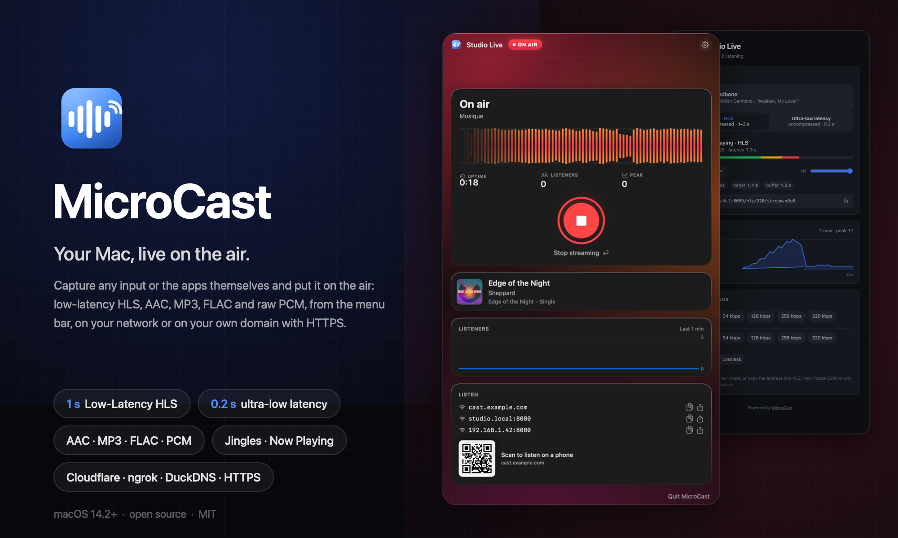
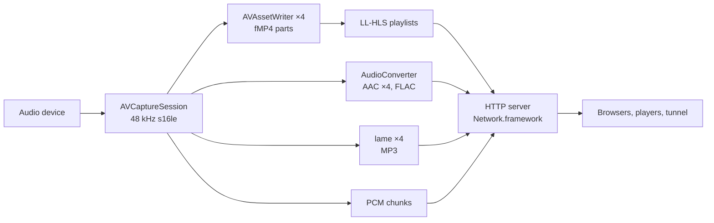

<p align="center">
  
</p>

<h1 align="center">MicroCast</h1>

<p align="center">
  Turn any audio input or the apps themselves into a live stream: low-latency HLS, AAC, MP3, FLAC and raw PCM,<br>
  from a menu bar app, on your network or on your own domain with HTTPS.
</p>

## Why

Streaming your Mac's audio somewhere else usually means Icecast, OBS or a paid service, and several seconds of
delay. MicroCast is the small tool in between: pick an input such as Elgato's **Wave Link Stream** mix, press
Start, and share a link. Listeners get a page that plays in about a second over HLS, or in 200 ms uncompressed on a
connection that can carry 1.5 Mbit/s, and hi-fi players get plain AAC, MP3 or lossless FLAC URLs.

## Features

- **Any input**: every Core Audio device, virtual ones included (Wave Link, BlackHole, Loopback, aggregate
  devices…), captured at 48 kHz stereo.
- **Or the apps themselves**: capture the output of chosen running applications, or of everything, through a
  system audio tap, optionally mixed with an input. No virtual audio driver needed.
- **Low-Latency HLS** with one AAC rendition per bitrate (64, 128, 256 and 320 kbps by default, configurable),
  partial segments, blocking reloads and preload hints. About 1.3 s in hls.js on a LAN.
- **Direct streams** for real players: AAC, MP3, FLAC (lossless) and raw PCM, with `icy-name`, ID3 and Vorbis
  tags so the stream name shows up in VLC, mpv or foobar2000.
- **A player page** served by the app: hls.js, quality selector, live latency and level, an ultra-low-latency
  PCM mode (~0.2 s, uncompressed), direct links, a listener graph, the track playing in Music or Spotify with
  its artwork, light and dark, lock-screen controls and Add-to-Home-Screen on phones.
- **Screen streaming**: capture a display or a region of it and show it on the page as low-latency MJPEG, with
  cinema mode and full screen. No audio sync, it's a visual companion.
- **Jingles**: drop audio files in a folder; at each track change in Music or Spotify (or on a button), one plays
  over the music, which fades to a set level and comes back, radio style.
- **Always there**: the address stays online between streams with an off-air page that starts playing by itself
  the moment you go live, so listeners can keep it bookmarked.
- **Internet in one click** through Cloudflare (no account needed), ngrok, Tailscale Funnel or any command that
  prints a URL, with an optional password. Or **your own domain, free**: DuckDNS keeps a fixed name pointed at
  your router and the app serves HTTPS with a Let's Encrypt certificate it obtains and renews itself.
- **Record while streaming** to FLAC, AAC or MP3 in `~/Music/MicroCast`.
- **Menu bar app**: level meters, one-click start, QR code and share sheet for the addresses, a listener graph
  with peak, a Settings window,
  Bonjour advertisement, `hostname.local` links, launch at login and auto-start.
- No third-party Swift dependencies: AVFoundation, AudioToolbox, Network.framework and SwiftUI only.

## Install

Download the DMG from the [releases](https://github.com/eko/microcast/releases), drag MicroCast to
Applications, launch it: it lives in the menu bar as a radio icon. macOS asks once for microphone access, which is
how it gates every audio input, and once for System Audio Recording when you capture applications.

The DMG is signed ad hoc, so Gatekeeper will complain on first launch: right-click → Open, or

```
xattr -d com.apple.quarantine /Applications/MicroCast.app
```

Or build it yourself (macOS 14.2+, Xcode command line tools):

```
git clone https://github.com/eko/microcast.git
cd microcast
./run.sh
```

MP3 needs `lame` (`brew install lame`); everything else uses codecs built into macOS.

## Use

1. Click the radio icon in the menu bar and press **Start streaming**. Wave Link Stream is selected by default
   when present; pick another input, or switch **Capture** to *Running applications* and tick the apps you want,
   in **Settings… → General** (⌘,).
2. The panel shows the level, the uptime and listener count, and the addresses to share: copy, AirDrop to your
   phone with the share button, open in the browser, or scan the QR code.
3. **Settings** holds the stream name and port; under **Stream** the HLS part and segment lengths (shorter = lower
   latency, more requests), which formats to produce (HLS, AAC, MP3, FLAC, PCM) and the list of bitrates;
   recording; and under **Internet** the tunnel and password. Changes apply on the next start; while live, the
   panel offers a one-click restart.

| Give this to… | URL |
|---|---|
| anyone with a browser | `http://<mac>.local:8080/` |
| VLC, mpv, foobar2000, a smart speaker | `http://<mac>.local:8080/stream.flac` or `/stream-256.mp3` |
| an HLS player, a website, OBS | `http://<mac>.local:8080/hls/master.m3u8` |
| ffmpeg, sox, your own code | `http://<mac>.local:8080/stream.pcm` |

The full list, headers and formats are in [docs/STREAMS.md](docs/STREAMS.md).

## Latency

| Path | Measured |
|---|---|
| Page, ultra-low-latency mode (uncompressed, 1.5 Mbit/s) | ~0.2 s |
| Page, LL-HLS, same network (334 ms parts) | 1.3 s |
| Page, LL-HLS through a Cloudflare tunnel | 2–3 s |
| VLC or mpv on a direct stream | 1–2 s |

## Internet

Pick a tunnel under **Settings → Internet**. Cloudflare's quick tunnel needs no account and gives a random
`trycloudflare.com` address; a named tunnel gives you a stable hostname on your domain; ngrok and Tailscale
Funnel work too, and *Custom command* runs anything that prints an `https://` URL. If you can forward a port on
your router, **DuckDNS + HTTPS** gives you a free fixed name (or your own hostname via CNAME) with a real
certificate and no buffering, and **Own hostname + HTTPS** does the same with a name your box already keeps
current. Set a password before you share the link. Details and measurements in
[docs/TUNNELS.md](docs/TUNNELS.md).

## How it works



Capture, encoding, packaging and serving all live in one process. [docs/ARCHITECTURE.md](docs/ARCHITECTURE.md)
walks through each piece, the LL-HLS rules, the encoder tricks and the latency budget.

## Documentation

- [Streams and endpoints](docs/STREAMS.md): every URL, format, header, and how to play them.
- [Tunnels](docs/TUNNELS.md): providers, setup, what works through which.
- [Architecture](docs/ARCHITECTURE.md): the code tour.
- [Troubleshooting](docs/TROUBLESHOOTING.md).
- [Changelog](CHANGELOG.md).

## Development

```
swift build            # debug build of the executable
swift test             # unit tests (playlist, encoders' headers, HTTP parsing, tunnel output)
./build.sh             # build/MicroCast.app
./dist.sh              # build/MicroCast-<version>.dmg (SIGN_IDENTITY / NOTARY_PROFILE for Developer ID)
```

```
Sources/MicroCast/     the app
Resources/             player page, icon
Tests/MicroCastTests/  XCTest suites
Tools/make-icon.swift  renders the icon
docs/                  documentation and screenshots
```

**Releases**: push a tag and CI does the rest.

```
git tag v1.1.0 && git push origin v1.1.0
```

The workflow runs the tests, builds the DMG with that version stamped into the bundle, and publishes a GitHub
release with the DMG, its SHA-256 and notes taken from the matching section of `CHANGELOG.md`. Tags with a
suffix (`v1.1.0-beta.1`) become pre-releases. Add the secrets `MACOS_CERT_P12` (base64 of a Developer ID
certificate), `MACOS_CERT_PASSWORD`, `MACOS_SIGN_IDENTITY`, and optionally `APPLE_ID`, `APPLE_TEAM_ID`,
`APPLE_APP_PASSWORD`, and the release build is signed and notarized so it opens without the Gatekeeper dance.

See [CONTRIBUTING.md](CONTRIBUTING.md).

## Ideas

Things that would fit and are not done: Opus in fMP4 for HLS, ICY in-stream titles ("now playing" from Music),
a second input mixed in (microphone over the mix), Sparkle updates, a Homebrew cask. Contributions welcome.

## License

[MIT](LICENSE) © Vincent Composieux
