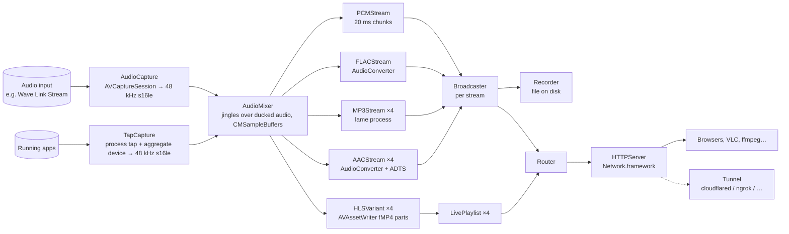

# Architecture

MicroCast is a single-process macOS app. Audio comes in from one Core Audio device, fans out to a handful of
encoders, and leaves through a tiny HTTP server. Everything runs in the app; the only external processes are
`lame` (MP3) and the optional tunnel CLI.

## Components

| Type | File | Job |
|---|---|---|
| `Streamer` | `Streamer.swift` | Owns the pipeline, drives the SwiftUI menu (`@Observable`, main actor), reads `Settings` from `UserDefaults`. |
| `AudioCapture` | `AudioCapture.swift` | `AVCaptureSession` on the chosen device; `AVCaptureAudioDataOutput.audioSettings` converts to 48 kHz stereo 16-bit. Hands each buffer to a sink as both `CMSampleBuffer` (for AVAssetWriter) and raw `Data`. |
| `TapCapture` | `TapCapture.swift` | The other `AudioSource`: a Core Audio process tap (`CATapDescription`) on the chosen apps or on everything, inside a private aggregate device that also holds the optional input device, so Core Audio compensates the clocks. Channels are summed to stereo, resampled with `AVAudioConverter`, wrapped in `CMSampleBuffer`s. `AudioApp` lists running apps by their responsible process; `SystemAudioPermission` asks for System Audio Recording. |
| `HLSVariant` | `HLSVariant.swift` | One AAC rendition (one per configured bitrate when HLS is enabled): `AVAssetWriter` with `outputFileTypeProfile = .mpeg4AppleHLS` and `preferredOutputSegmentInterval` = one part. Segments arrive through `AVAssetWriterDelegate`. Injects the stream title into the init segment. |
| `LivePlaylist` | `LivePlaylist.swift` | The media playlist of a rendition: parts, segments, sliding window, blocking-reload waiters, rendering. Pure Swift, unit tested. |
| `PacketEncoder` | `PacketEncoder.swift` | Core Audio's AAC and FLAC encoders in streaming mode. `AACStream` frames packets in ADTS, `FLACStream` prepends the `fLaC` header. |
| `MP3Stream` | `MP3Stream.swift` | A `lame` process per bitrate, PCM on stdin, MP3 on stdout, ID3 preamble for new listeners. |
| `PCMStream` | `PCMStream.swift` | Raw PCM coalesced into 20 ms chunks for the page's ultra-low-latency mode (uncompressed, 1.5 Mbit/s). |
| `Broadcaster` | `Broadcaster.swift` | Fan-out of a byte stream to any number of consumers, each an `AsyncStream` with a bounded buffer. |
| `Recorder` | `Recorder.swift` | A consumer that writes to a file. |
| `ListenerHistory` | `ListenerHistory.swift` | Listener counts sampled every 5 s for an hour, with the peak; feeds the popover chart (Swift Charts) and the page sparkline through `/status.json`. |
| `HTTPServer` | `HTTPServer.swift` | HTTP/1.1 on `NWListener`: GET/HEAD, keep-alive, endless bodies, Bonjour registration, optional TLS from a `SecIdentity`. |
| `Router` | `Router.swift` | URL → response. Basic auth, listener counting, `/status.json`, playlists, segments, streams. |
| `Tunnel` | `Tunnel.swift` | Spawns the tunnel CLI, parses its output for the public URL (`TunnelOutputParser`, unit tested). |
| `DuckDNSPublisher` | `DuckDNS.swift` | Port-forwarding modes: keeps a DuckDNS name pointed here (IPv4 only) or trusts the router's DynDNS, obtains and renews the certificate (DNS-01 through DuckDNS, HTTP-01 otherwise), hands the identity to an HTTPS listener. |
| `ACMEClient` | `ACME.swift` | RFC 8555 client on CryptoKit ES256 JWS with DNS-01 and HTTP-01; CSR through the system `openssl`; `ACMEChallengeStore` backs `/.well-known/acme-challenge/`. Unit tested; verified against Let's Encrypt staging. |
| `TLSIdentity` | `TLS.swift` | PEM → PKCS#12 → `SecIdentity` for Network.framework, expiry parsing. |
| `MenuView` | `MenuView.swift` | The menu bar panel: status, meters, start/stop, addresses, QR code, recording, banners. |
| `SettingsView` | `SettingsView.swift` | The Settings window (⌘,): General, Stream, Internet, Recording, About. |
| `Components` | `Components.swift` | `LevelMeter`, `CopyButton`, `Banner`, `PrimaryButtonStyle`, QR generation. |

## Threads and queues

- Capture callbacks arrive on a serial `userInteractive` queue and only copy bytes and dispatch.
- Every encoder has its own serial queue; encoding one 5 ms buffer costs well under a millisecond.
- `LivePlaylist` and `Broadcaster` are lock-protected and callable from anywhere.
- The HTTP server bridges Network.framework callbacks to Swift concurrency; each connection is a `Task`.
- `Streamer` lives on the main actor; a 20 Hz timer refreshes the meters (with a decaying peak hold), the
  counters, and compares the live settings with the snapshot taken at start to offer a restart.

## Low-Latency HLS

- Part duration is a setting (200 ms to 1 s, default 334 ms). AVAssetWriter cuts on AAC frame boundaries
  (1024 samples = 21.3 ms), so parts come out at 320 or 341 ms for a 334 ms request. `PART-TARGET` is therefore
  advertised as the requested duration plus one frame.
- A segment is `partsPerSegment` parts (segment duration ÷ part duration, rounded). `EXT-X-TARGETDURATION` is
  `partsPerSegment × PART-TARGET` rounded up.
- `PART-HOLD-BACK` is three part targets: hls.js and Safari settle about one second above that.
- Blocking reloads: `_HLS_msn` / `_HLS_part` register a waiter that is resumed when the part arrives, or
  after 3 × target duration. Requests that can never be satisfied (part index past the end of a complete
  segment, sequence more than two ahead, sequence already dropped) return immediately.
- The window keeps six complete segments plus the one in progress. Old parts are dropped from memory with them.
- Every `EXTINF` carries the stream name as its title; the master playlist adds `EXT-X-SESSION-DATA`.
- The AAC encoder needs a few hundred milliseconds to warm up, during which `AVAssetWriterInput` refuses
  samples. `HLSVariant` keeps a backlog instead of dropping audio.

## Encoders

`PacketEncoder` wraps `AudioConverterFillComplexBuffer` in the usual streaming pattern: the input callback hands
over whatever PCM is pending and returns a private "out of input" status when there is none, which makes the
converter return the packets it could complete while keeping the leftover frames internally. AAC packets are
1024 frames, FLAC packets 4608 frames. FLAC's STREAMINFO is recovered from the converter's magic cookie (a `dfLa`
box whose last 34 bytes are the block); the stream header adds a VORBIS_COMMENT with the title.

macOS has no MP3 encoder, hence `lame --flush` per bitrate. Its stdout is read on a `readabilityHandler` and
published as-is; MP3 decoders resync on frame headers, so joining mid-stream is fine.

## Back-pressure

`Broadcaster.publish` never blocks: each subscriber is an `AsyncStream` with `bufferingNewest(64)`, so a client
that stops reading loses the oldest chunks instead of adding delay for everyone. HTTP writes for streaming bodies
use `Connection: close` and no length, the same shape as Icecast.

## Permissions and signing

Capturing any input device, virtual ones included, requires the microphone permission
(`NSMicrophoneUsageDescription`). Capturing applications requires *System Audio Recording Only*
(`NSAudioCaptureUsageDescription`). Process taps never prompt by themselves and just deliver silence without the
grant; there is no public API to ask, so `SystemAudioPermission` calls the TCC framework's preflight and request
functions through `dlsym`, the same approach as AudioCap, and simply proceeds if those symbols ever disappear. The app is ad-hoc signed by `build.sh`, so the grant is keyed to the build's
code hash and macOS may ask again after a rebuild. `dist.sh` can sign with a Developer ID and notarize; that path
enables the hardened runtime, which is why `entitlements.plist` declares `com.apple.security.device.audio-input`.

## Settings

All in `UserDefaults` under `local.microcast`:

| Key | Default | Meaning |
|---|---|---|
| `deviceUID` | Wave Link Stream if present | Core Audio device UID |
| `sourceMode` | device | `device` (the input) or `apps` (a system audio tap) |
| `allApps`, `selectedApps`, `mixInput` | false, empty, false | which apps to tap (bundle identifiers, comma-separated) and whether to add the input |
| `port` | 8080 | HTTP port |
| `partDuration` | 0.334 | HLS part length in seconds |
| `bitrates` | empty = 64, 128, 256, 320 | comma-separated kbps, clamped to 64–320, at most eight |
| `enableHLS`, `enableAAC`, `enableMP3`, `enableFLAC`, `enablePCM` | true | which outputs to produce |
| `segmentDuration` | 2 | HLS segment length in seconds |
| `streamName` | MicroCast | title everywhere |
| `password` | empty | HTTP Basic password when set |
| `tunnelProvider` | off | `cloudflare`, `cloudflareNamed`, `ngrok`, `tailscale`, `custom`, `duckdns`, `ownHost` |
| `ownHostname` | | the DynDNS name for `ownHost` |
| `duckSubdomain`, `duckToken`, `duckHostname`, `duckPublicPort`, `httpsEnabled`, `httpsPort`, `acmeEmail` | | DuckDNS + HTTPS; `acmeStaging` (hidden) targets Let's Encrypt's staging CA |
| `cloudflareToken`, `cloudflareHostname` | | named tunnel |
| `customTunnelCommand` | | `{port}` placeholder |
| `recordFormat` | off | `flac`, `aac`, `mp3` |
| `recordFolder` | ~/Music/MicroCast | |
| `autoStart` | false | start streaming when the app launches |
| `keepOnline` | true | keep the address up between streams and serve the off-air page (also goes online at launch) |
| `nowPlayingEnabled` | true | in input mode, show the Music/Spotify track; in app-capture mode it follows the captured apps |
| `lastLive` | | when the last stream ended, for the off-air page |
| `jinglesEnabled`, `jingleFolder`, `jingleDuckDecibels`, `jingleVolume`, `jingleLeadSeconds` | false, ~/Music/MicroCast/Jingles, −12, 1.0, 2 | jingles at track changes; with a lead time the player's position and duration schedule the jingle before the declared end, the change itself is the fallback; polling of Music/Spotify drops to 1 s when enabled |

## Latency budget (measured on an M-series Mac, 334 ms parts)

| Path | Typical |
|---|---|
| Capture + conversion | ~10 ms |
| PCM mode on the page (uncompressed) | 0.15 s scheduling headroom + network ≈ 0.2 s |
| Direct streams in VLC/mpv | 1–2 s (player buffer) |
| LL-HLS in hls.js, same network | 1.3 s |
| LL-HLS through Cloudflare | +0.3–1 s |
